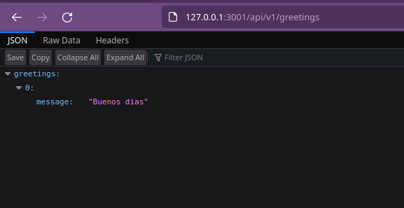

# hello-rails-back-end
This is the back-end part of a two-part project. This repo contains the an API the responds with random greetings.
You can find the front end part [here](https://github.com/eduardosancho/hello-react-front-end).

It was deployed with Heroku to [this url](https://desolate-tundra-61515.herokuapp.com/api/v1/greetings).

## Preview

### Requirements
Make sure you have Ruby on Rails installed.

Refer to [Section 3](https://guides.rubyonrails.org/v5.1/getting_started.html#:~:text=3%20Creating%20a%20New%20Rails%20Project) from the official [Rails Guide](https://rubyonrails.org/) to install rails in your machine.

### Clone this repo
~~~ bash
git clone https://github.com/eduardosancho/hello-rails-back-end.git
~~~

### Getting started
Install dependencies:
~~~ bash
bundle install
~~~

Create database:
~~~ bash
rails db:setup
~~~

Start server at port 3001:
~~~ bash
rails s -p 3001
~~~

## Collaborators
👤 **Eduardo**

 Platform | Badge |
 --- | --- |
 **GitHub**  | [@eduardosancho](https://github.com/eduardosancho)
 **Twitter** | [@sanchitoblog](https://twitter.com/sanchitoblog)
 **LinkedIn** | [Eduardo Sancho Solano](https://www.linkedin.com/in/eduardo-sancho-solano/)

 
## Show your support

Give a ⭐️ if you like this project!

## Acknowledgments

The ideas and inspiration from this project are coming from this online school of software development:
 [**Microverse**](https://www.microverse.org/)

## 📝 License

This project is [MIT](./MIT.md) licensed.
